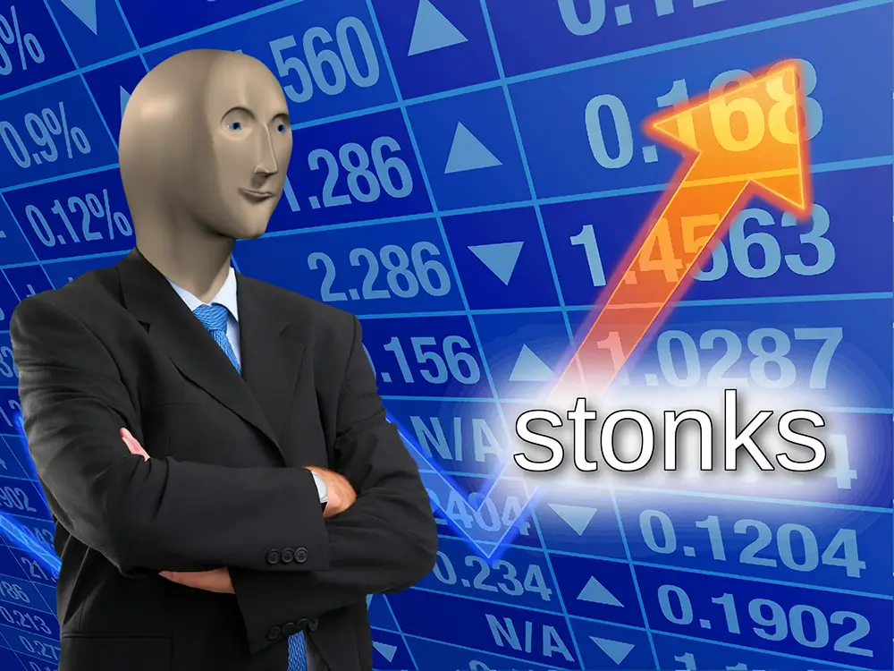

# Stonks Website ($STNK ⇄ $STONKS)

<div align="center">
  
    <p>Stonks is the first memecoin on Solana (deployed April 2021).<br />Fully onchain IP rights. Community owned. There is no second first.</p>
</div>

## Dev

Next.js 15 + Solana wallet integration + token wrapper UI

### Run

```bash
bun install
bun dev
```

### Env

Copy `.env.example` → `.env.local` and set all variables

### Build

```bash
bun run build
npx serve@latest out
```
